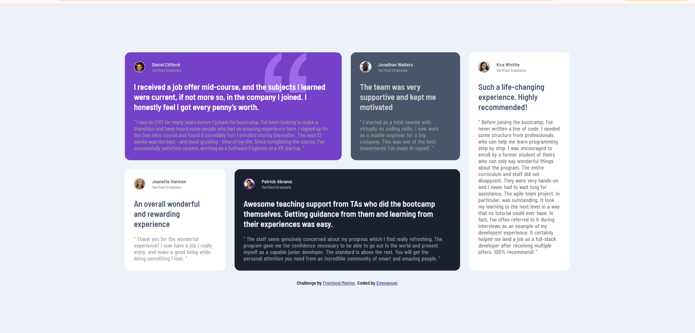

# Frontend Mentor - Testimonials grid section solution

This is a solution to the [Testimonials grid section challenge on Frontend Mentor](https://www.frontendmentor.io/challenges/testimonials-grid-section-Nnw6J7Un7). Frontend Mentor challenges help you improve your coding skills by building realistic projects.

## Table of contents

- [Overview](#overview)
  - [The challenge](#the-challenge)
  - [Screenshot](#screenshot)
  - [Links](#links)
  - [Built with](#built-with)
  - [What I learned](#what-i-learned)
  - [Continued development](#continued-development)
  - [Useful resources](#useful-resources)
- [Author](#author)
- [Acknowledgments](#acknowledgments)

## Overview

### The challenge

Users should be able to:

- View the optimal layout for the site depending on their device's screen size

### Screenshot



### Links

- Solution URL: [https://github.com/Notobd/testimonials-grid](https://your-solution-url.com)
- Live Site URL: [https://testimonials-grid-indol.vercel.app/](https://your-live-site-url.com)

### Built with

- Semantic HTML5 markup
- CSS custom properties
- Flexbox
- CSS Grid

### What I learned

Learnt how to use the grid layout for the first time and felt comforatble using it and also dabbled into positioning for the first time and got assistance from a mentor.

```css
#patTestimonial {
  grid-column: 2 / span 2;
  grid-row: 2;
}
```

```css
.quote-container {
  position: absolute;
  z-index: 10;
  left: 130px;
}
```

### Continued development

practice with more tasks that have to do with grid to better understand it.

### Useful resources

- [https://www.w3schools.com/CSS/tryit.asp?filename=trycss_grid_item](https://www.example.com) - This really helped me how to set grid layout. I really liked this pattern and will use it going forward.

## Author

- Frontend Mentor - [@notobd](https://www.frontendmentor.io/profile/notobd)
- Twitter - [@n0tobd](https://www.twitter.com/n0tobd)

## Acknowledgments

Gracias Favour.
